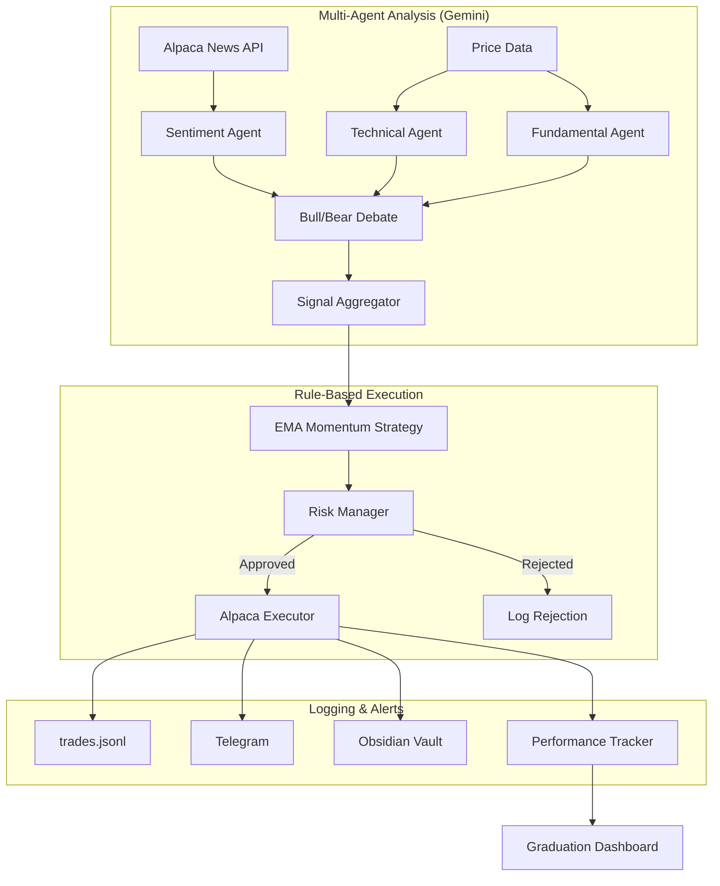

<!-- Project Header -->
<div align="center">

  

# Claude Trader

**Hybrid AI trading bot: multi-agent analysis with rule-based risk management.**

  <!-- TODO: Add CI badge once GitHub Actions workflow is configured -->

[](https://www.python.org/)
[](LICENSE)
[](#safety)

</div>

## Table of Contents

- [Features](#features)
- [Architecture](#architecture)
- [Getting Started](#getting-started)
- [Usage](#usage)
- [Configuration](#configuration)
- [Graduation to Live](#graduation-to-live)
- [Safety](#safety)
- [Development](#development)
- [License](#license)

## Features

- **Multi-agent analysis pipeline** - 4 specialized Gemini-powered agents (sentiment, technical, fundamental, bull/bear debate) with signal aggregation and contrarian filtering
- **Rule-based risk management** - Zero LLM dependency for risk decisions: position sizing, stop losses, trailing stops, daily loss limits, max drawdown halts, and circuit breakers
- **EMA Momentum strategy** - Buy on 20-day EMA crossover with positive sentiment confirmation; sell on crossover below or trailing stop trigger
- **Paper trading by default** - Live trading requires explicit opt-in with `CONFIRM LIVE` confirmation prompt
- **Graduation dashboard** - 6 criteria (30+ days, positive return, Sharpe > 0.5, drawdown < 10%, no circuit breakers, manual review) must all pass before going live
- **Telegram alerts** - Real-time trade notifications and daily P&L summaries
- **Obsidian integration** - Daily trade logs with frontmatter, wiki-links, and knowledge graph connectivity
- **Cron-based operation** - Autonomous weekday scheduling: market open scan, midday check, end-of-day summary

## Architecture

The bot follows a hybrid approach: AI provides analysis, deterministic rules handle execution and risk.



## Getting Started

### Prerequisites

- Python >= 3.14
- [uv](https://github.com/astral-sh/uv) package manager
- [Alpaca](https://alpaca.markets/) account (paper trading)
- [Google Gemini](https://ai.google.dev/) API key (for multi-agent analysis)
- Telegram bot token (optional, for alerts)

### Installation

```bash
git clone git@github.com:davidrneves/claude-trader.git
cd claude-trader
uv sync
cp .env.example .env
# Edit .env with your API keys
```

### Quick Start

```bash
# Run a single trading cycle
uv run python scripts/run.py

# End-of-day summary only
uv run python scripts/run.py --summary

# Check graduation criteria
uv run python scripts/run.py --graduation
```

## Usage

### Single Cycle

The bot runs one analysis-and-execution cycle per invocation:

```bash
uv run python scripts/run.py
```

Each cycle:

1. Checks market hours (9:30 AM - 4:00 PM ET)
2. Runs risk pre-checks (circuit breakers, daily loss limit)
3. Scans existing positions for sell signals
4. Analyzes watchlist symbols through the multi-agent pipeline
5. Executes approved trades with automatic stop-loss orders
6. Logs to JSONL, Obsidian, and Telegram

### Autonomous Scheduling

Install cron jobs for weekday operation:

```bash
bash scripts/install-cron.sh
```

This schedules three daily runs (ET):

- **9:45 AM** - Market open scan (after the first 15 banned minutes)
- **12:00 PM** - Midday check
- **4:15 PM** - End-of-day summary

### Graduation Dashboard

Track paper trading performance against go-live criteria:

```bash
uv run python scripts/graduation.py
uv run python scripts/graduation.py --metrics  # Detailed metrics
```

## Configuration

All settings are managed via environment variables or `.env` file.

| Variable                 | Description                   | Default         | Required |
| ------------------------ | ----------------------------- | --------------- | -------- |
| `ALPACA_API_KEY`         | Alpaca API key                | -               | Yes      |
| `ALPACA_SECRET_KEY`      | Alpaca secret key             | -               | Yes      |
| `ALPACA_PAPER_TRADE`     | Paper trading mode            | `true`          | No       |
| `GEMINI_API_KEY`         | Google Gemini API key         | `""`            | No       |
| `TELEGRAM_BOT_TOKEN`     | Telegram bot token            | `""`            | No       |
| `TELEGRAM_CHAT_ID`       | Telegram chat ID              | `""`            | No       |
| `WATCHLIST`              | Comma-separated symbols       | `AAPL,MSFT,...` | No       |
| `EMA_PERIOD`             | EMA period for strategy       | `20`            | No       |
| `MAX_POSITION_PCT`       | Max portfolio % per trade     | `0.02`          | No       |
| `STOP_LOSS_PCT`          | Stop loss below entry         | `0.08`          | No       |
| `TRAILING_STOP_PCT`      | Trailing stop trail           | `0.05`          | No       |
| `MAX_DAILY_LOSS_PCT`     | Daily loss halt threshold     | `0.03`          | No       |
| `MAX_DRAWDOWN_PCT`       | Total drawdown halt threshold | `0.10`          | No       |
| `MAX_CONSECUTIVE_LOSSES` | Circuit breaker threshold     | `3`             | No       |
| `MAX_OPEN_POSITIONS`     | Max concurrent positions      | `5`             | No       |

### Risk Rules

| Rule               | Default                     | Effect                                 |
| ------------------ | --------------------------- | -------------------------------------- |
| Max position size  | 2% of portfolio             | Limits exposure per trade              |
| Stop loss          | 8% below entry              | Automatic stop-loss order on every buy |
| Trailing stop      | 5% trail (floor only up)    | Locks in gains as price rises          |
| Max daily loss     | 3%                          | Halts all buying for the day           |
| Max drawdown       | 10%                         | Halts all buying until recovery        |
| Circuit breaker    | 3 consecutive losses        | Pauses buying until a win              |
| Max open positions | 5                           | Prevents over-diversification          |
| Banned hours       | First/last 15min of session | Avoids open/close volatility           |

## Graduation to Live

All 6 criteria must pass before switching from paper to live trading:

| Criterion                 | Threshold |
| ------------------------- | --------- |
| Paper trading days        | >= 30     |
| Cumulative return         | > 0%      |
| Sharpe ratio              | > 0.5     |
| Max drawdown              | < 10%     |
| Circuit breaker (last 7d) | 0 days    |
| Manual review             | Completed |

## Safety

- **Paper trading is the default.** `ALPACA_PAPER_TRADE=true` is set out of the box.
- **Live trading requires double opt-in**: set `ALPACA_PAPER_TRADE=false` in `.env` AND type `CONFIRM LIVE` at the prompt.
- **Every buy order passes through the risk manager.** No trade executes without approval.
- **Sells are always allowed** - reducing exposure is never blocked.
- **API keys live in `.env` only** - never committed to version control.
- **No third-party trading plugins** - only official Alpaca and Google SDKs.

## Development

```bash
uv sync --group dev        # Install dev dependencies
uv run pytest              # Run tests
uv run ruff check .        # Lint
uv run ruff format --check # Format check
```

### Project Structure

```
src/claude_trader/
  bot.py          # Main orchestrator - the trading loop
  analyst.py      # Multi-agent analysis (Gemini-powered)
  strategy.py     # EMA Momentum strategy
  risk.py         # Rule-based risk manager
  executor.py     # Alpaca API execution wrapper
  performance.py  # Performance tracking and graduation
  news.py         # Alpaca News API integration
  notifier.py     # Telegram notifications
  obsidian.py     # Obsidian vault daily logs
  logger.py       # JSONL trade logging
  config.py       # Pydantic Settings configuration
  constants.py    # Market hours and timezone
scripts/
  run.py          # CLI entry point
  graduation.py   # Graduation dashboard
  install-cron.sh # Cron job installer
```
